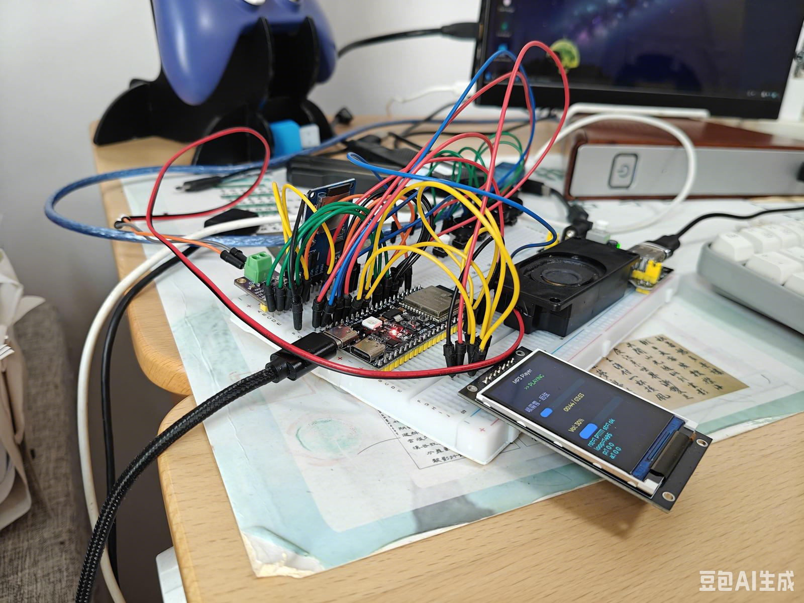
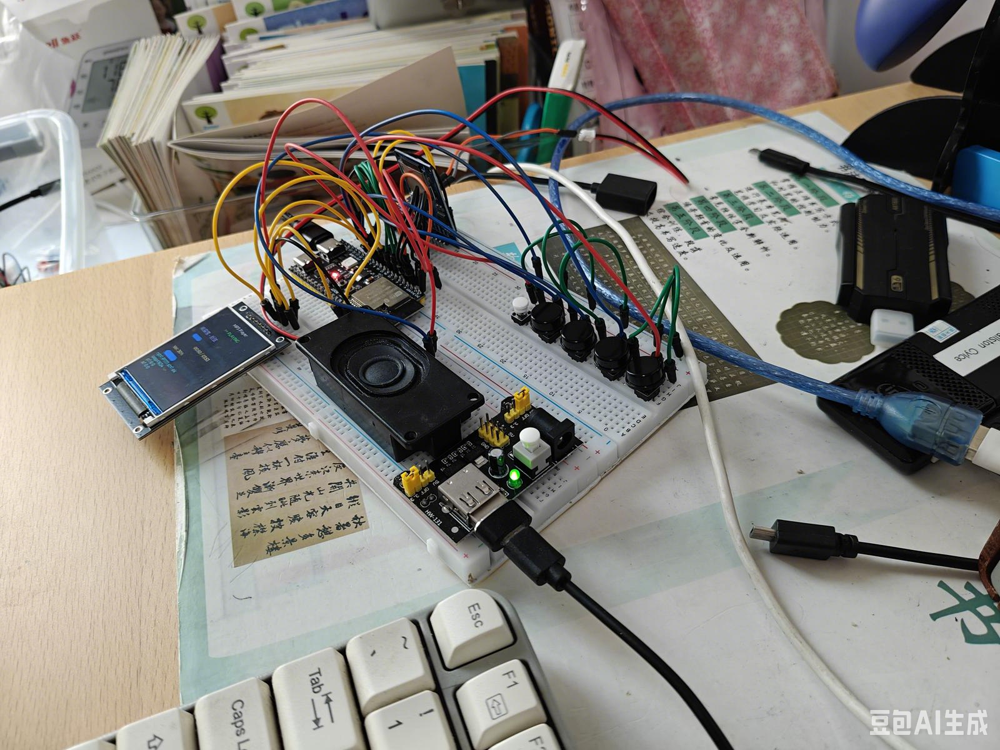
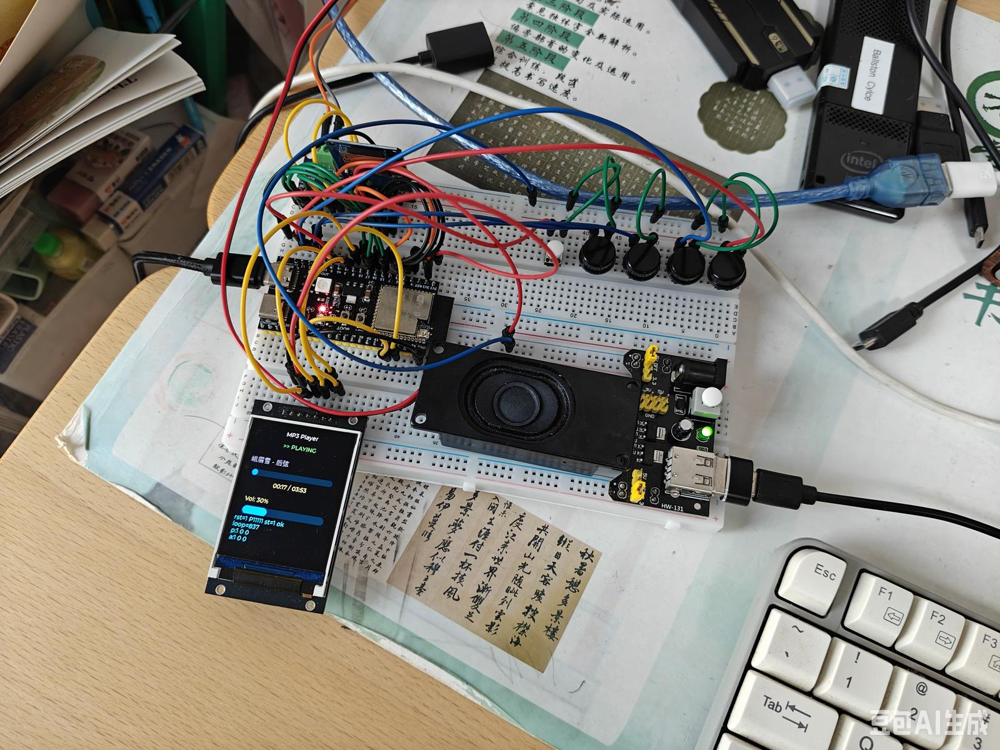

# ESP32-S3 MP3 Player

基于 ESP32-S3 的便携式 MP3 播放器：从 SD 卡读取 MP3 文件，经 `esp_audio_codec` 解码后通过 I2S 功放输出，配有 2.4 寸 ST7789 SPI 彩屏和 LVGL 图形界面，支持 5 个实体按键操作与 GBK 中文文件名显示。

[English](README.en.md) | 简体中文


## 效果展示

| 播放界面 | 电路搭建 | 播放特写 |
| :---: | :---: | :---: |
|  |  |  |

## 目录

- [效果展示](#效果展示)
- [功能特性](#功能特性)
- [实测性能指标](#实测性能指标)
- [硬件平台与接线](#硬件平台与接线)
- [系统架构](#系统架构)
- [目录结构](#目录结构)
- [关键实现细节](#关键实现细节)
- [可调参数](#可调参数app_configh)
- [开发环境与依赖](#开发环境与依赖)
- [编译与烧录](#编译与烧录)
- [使用说明](#使用说明)
- [界面说明](#界面说明)
- [串口日志与诊断](#串口日志与诊断)
- [硬件相关的特殊适配（重要）](#硬件相关的特殊适配重要)
- [常见问题 FAQ](#常见问题-faq)
- [已知限制](#已知限制)

## 功能特性

- **MP3 解码播放**：基于乐鑫官方 `esp_audio_codec` 组件（simple decoder API），支持 MPEG-1/2/2.5 Layer III、任意采样率（8/11.025/12/16/22.05/24/32/44.1/48 kHz）与 VBR/CBR；首帧解析出真实格式后动态重配 I2S，单声道自动上混为立体声
- **稳定无卡顿播放**：分片喂入解码器（每次 ≤ 768 B ≈ 2 帧）+ 未消费字节 holdover 拼接；16 × 240 帧 I2S DMA 缓冲（约 87 ms 余量）吸收解码突发；实测播放速率偏差 +0.003%（WS 实测 44101 Hz），连续播放零 underrun
- **SD 卡存储**：SDSPI（SPI2_HOST）+ FATFS VFS，挂载失败自动重试 2 次；递归扫描整卡音频文件，播放列表最多 2048 首，路径全部存放于 PSRAM
- **中文文件名**：FATFS 开启 UTF-8 文件名 API，内置 Noto Sans SC 16 px / 4 bpp 全 GB2312 字库，FAT 上 GBK 编码的中文歌名直接正常显示
- **LVGL 图形界面**：240×320 ST7789 RGB565 彩屏，曲目名滚动、播放状态、音量条、进度条与已播放/总时长显示
- **全屏歌曲列表**：长按上一曲/下一曲进入全屏歌曲浏览界面；列表内短按上一曲/下一曲上下移动光标（带蓝色高亮 + `>` 前缀标记），按播放键播放选中曲目并自动返回播放界面，长按上一曲/下一曲退出列表
- **5 键实体操控**：播放/暂停、上一曲、下一曲、音量加、音量减；30 ms 软件消抖，音量键支持 500 ms 长按后每 200 ms 连发，上一曲/下一曲键支持 500 ms 长按切列表
- **曲目时长探测**：解析 Xing/Info/VBRI VBR 帧头获取精确帧数，无 VBR 头时按首帧码率 + 文件大小估算 CBR 时长，并扣除 ID3v2/ID3v1 标签
- **容错启动**：显示与 UI 最先初始化，SD 卡缺失或挂载失败不阻断启动，系统照常运行；单曲播放结束自动切下一首
- **健壮的读盘容错**：SD 瞬时读错误（数据 CRC 等）自动回退扇区重试（最多 20 次）；I2S 写超时保留已入队字节、仅重试剩余部分

## 实测性能指标

| 指标 | 实测值 |
| --- | --- |
| 播放速率偏差（44.1 kHz 音源） | +0.003%（I2S WS 实测 44101 Hz） |
| DMA underrun | 0 |
| I2S write timeout | 0 |
| 单次解码峰值耗时（768 B 输入） | ≤ 17.9 ms |
| I2S DMA 缓冲容量 | 16 × 240 立体声帧 ≈ 15.4 KB ≈ 87 ms |
| 固件体积 | 约 1.5 MB（factory 分区 4 MB） |
| LCD SPI 时钟 | 40 MHz |
| SD 卡工作时钟 | 限频 2 MHz（杜邦线长线下稳定值） |

## 硬件平台与接线

### 物料清单

| 项目 | 规格 |
| --- | --- |
| 主控板 | ESP32-S3（板载 16 MB Flash（Boya）+ 8 MB 八线 PSRAM），USB 口为原生 USB CDC（`/dev/ttyACM0`，GPIO19/20） |
| 显示屏 | ST7789 240×320 SPI 7 针屏（无 MISO、无背光控制脚，VCC 直接供电） |
| 音频功放 | MAX98357A I2S D 类功放模块，VIN 接 5 V，直接驱动小喇叭 |
| 存储 | Micro SD 卡模块（自带稳压芯片 + 电平转换），FAT32；开发用卡为 SDSC "SD512" 478 MB |
| 按键 | 5 个轻触按键，低电平有效（一端接 GPIO、另一端接 GND，使用内部上拉） |

### 接线表

引脚全部集中定义在 [`main/config/board.h`](main/config/board.h)，改线只需修改该文件。

| 模块 | 信号 | GPIO | 备注 |
| --- | --- | --- | --- |
| SD 卡 | CS | 4 | **模块 VCC 必须接 5 V**，3.3 V 下 ACMD41 永不完成 |
| SD 卡 | SCK | 5 | SPI2_HOST，工作时钟限 2 MHz |
| SD 卡 | MOSI | 6 | |
| SD 卡 | MISO | 7 | |
| LCD | SCK | 8 | SPI3_HOST，40 MHz |
| LCD | MOSI | 9 | 屏无 MISO |
| LCD | CS | 1 | |
| LCD | DC | 2 | |
| LCD | RST | 3 | |
| 按键 | 播放/暂停 | 10 | 列表态播放选中曲目 |
| 按键 | 上一曲 | 11 | 长按切列表；列表态光标上移 |
| 按键 | 下一曲 | 12 | 长按切列表；列表态光标下移 |
| 按键 | 音量 + | 13 | 长按连发 |
| 按键 | 音量 − | 14 | 长按连发 |
| MAX98357A | BCLK | 15 | VIN 接 5 V |
| MAX98357A | LRC (WS) | 16 | |
| MAX98357A | DIN | 17 | |

> 注意：GPIO18 在 `board.h` 中保留为 `I2S_GAIN_GPIO` 但当前未使用；BOOT 键（GPIO0）不参与任何播放控制。

### 接线示意

```
ESP32-S3
├── SPI2 (SD 卡模块, VCC=5V)        ├── SPI3 (ST7789 LCD)
│   SCK  ────────── GPIO5           │   SCK  ────────── GPIO8
│   MOSI ────────── GPIO6           │   MOSI ────────── GPIO9
│   MISO ────────── GPIO7           │   CS   ────────── GPIO1
│   CS   ────────── GPIO4           │   DC   ────────── GPIO2
│                                   │   RST  ────────── GPIO3
├── I2S0 (MAX98357A, VIN=5V)        │
│   BCLK ────────── GPIO15          └── 按键（另一端全部接 GND）
│   LRC  ────────── GPIO16              播放 GPIO10  上一曲 GPIO11
│   DIN  ────────── GPIO17              下一曲 GPIO12 音量+ GPIO13
└──                                       音量- GPIO14
```

## 系统架构

### 启动流程（`app_main`）

```
power_init()                         # 电源（当前为占位，3.3V 直供）
  └─ display_init()                  # SPI3 + ST7789 + LVGL port（优先启动，无卡也能亮屏）
      └─ ui_init()                   # 构建 LVGL 界面
          └─ sd_card_mount()         # SDSPI 挂载，失败仅告警、不中止
              └─ file_list_scan()    # 递归扫描 /sdcard，排序；无文件则尝试创建 /sdcard/music
                  └─ i2s_output_init()
                      └─ player_init()   # 命令队列 + 256KB 文件环形缓冲
                          └─ button_init()
                              └─ 启动 player_task / file_task / button_task / monitor_task
```

### 双核任务分工

| 任务 | 核心 | 优先级 | 栈 | 职责 |
| --- | --- | --- | --- | --- |
| `player_task` | Core 0 | 8 | 12 KB | 从环形缓冲取压缩数据 → MP3 解码 → 软件音量 → 写 I2S；处理播放命令、切歌、时长统计 |
| `file_task` | Core 1 | 5 | 4 KB | 以 512 B 单扇区为单位 `fread()` SD 文件，写入文件环形缓冲；读错误回退重试 |
| LVGL 任务（组件内部创建） | Core 1 | 5 | 6 KB | LVGL 定时刷新，周期 5 ms |
| `button_task` | Core 1 | 3 | 4 KB | 10 ms 周期扫描 5 个按键，消抖/长按/连发，向 player 命令队列投递命令 |
| `monitor_task` | Core 1 | 1 | 2 KB | 100 ms 周期刷新 UI（播放界面下刷新状态/歌名/进度/音量，列表界面下不刷新） |

### 数据流

```
SD 卡 (FATFS)
   │  512B 单扇区读, file_task @Core1
   ▼
文件环形缓冲 (256 KB, PSRAM)
   │  每次 ≤768B 喂入, player_task @Core0
   ▼
MP3 解码器 (esp_audio_codec)
   │  holdover 保留未消费字节，保证帧边界不错乱
   ▼
PCM 缓存 (128 KB, PSRAM, 16bit)
   │  单声道就地扩展为立体声；软件音量缩放
   ▼
I2S DMA (16 × 240 帧 ≈ 87ms)  ──►  MAX98357A  ──►  喇叭
```

播放控制走 FreeRTOS 队列（深度 10）：按键任务只投递命令，所有重操作（`fopen` / 解码器开关）都在 12 KB 栈的 `player_task` 中执行，避免按键任务栈溢出。

## 目录结构

```
├── CMakeLists.txt                 # 顶层工程文件 (project: mp3_player)
├── partitions.csv                 # 自定义分区表：nvs 24K / phy 4K / factory 4M
├── sdkconfig.defaults             # 默认配置：ESP32-S3、八线 PSRAM、16MB Flash、
│                                  #   FATFS UTF-8、LVGL 16 位色
├── sdkconfig                      # 当前实际配置
├── dependencies.lock              # 托管组件版本锁定
└── main/
    ├── CMakeLists.txt             # 组件注册（源文件、REQUIRES、INCLUDE_DIRS）
    ├── idf_component.yml          # 托管组件依赖声明
    ├── app_main.c                  # 启动入口与任务编排、monitor_task
    ├── config/
    │   ├── board.h                # 全部硬件引脚定义（改线只改这里）
    │   └── app_config.h           # 缓冲区/DMA/按键时序/任务栈与优先级
    ├── storage/
    │   ├── sd_card.c/.h           # SDSPI 总线初始化、FAT 挂载（2 次重试）、卸载
    │   └── file_list.c/.h         # 递归扫描、扩展名过滤、字典序排序、
    │                              #   上一首/下一首循环游标（PSRAM 存储）
    ├── audio/
    │   ├── decoder.c/.h           # esp_audio_codec 封装：holdover、首帧格式解析、
    │                              #   单声道上混、PCM 缓存、EOS 冲刷、解码统计
    │   └── i2s_output.c/.h        # I2S STD 主模式通道、动态采样率重配、auto_clear
    ├── player/
    │   ├── player.c/.h            # 播放状态机、命令队列、音量、时长探测、
    │                              #   player_task/file_task、节奏自检日志
    │   └── ringbuf.c/.h           # 字节环形缓冲（PSRAM）
    ├── display/
    │   ├── display.c/.h           # SPI3 总线、ST7789 面板、LVGL port 初始化
    │   ├── ui.c/.h                # LVGL 界面：标题/状态/歌名/进度/音量/文件列表
    │   ├── cjk16.c                # Noto Sans SC 16px 4bpp 全 GB2312 字库（约 6MB 源文件）
    │   └── gb2312_symbols.txt     # 字库生成用字符表
    ├── input/
    │   └── button.c/.h            # 5 键扫描：消抖、长按判定、音量连发、
    │                              #   长按 Prev/Next 切换列表、列表内上下选择与播放
    └── power/
        └── power.c/.h             # 电源初始化占位
```

## 关键实现细节

### 1. MP3 帧边界与 holdover 机制

解码器内置帧同步解析器，每次 `process()` 只消费输入中的一部分字节（`raw.consumed`）。如果把未消费字节丢弃，下一帧数据会从错误位置开始，表现为杂音或变调。`decoder.c` 中维护一个 `hold[]` 缓存：每次喂入前将上次的残留拼接到新数据之前（`scratch = hold + new chunk`），`drain()` 结束后把剩余字节重新拷回 `hold`，保证解码器永远看到连续无缺口的字节流。

### 2. 首帧解析 + I2S 动态重配

MP3 的真实采样率/声道数只有解出第一帧后才知道。解码器自己的 `get_info()` 并不可靠，因此代码额外扫描第一个帧同步字（11 位同步 + MPEG 版本/层/采样率索引/声道模式），在喂入前就确定格式；首个 PCM 帧输出后再用 `get_info()` 校正。`player_task` 发现采样率变化时调用 `i2s_output_set_sample_rate()`：disable 通道 → `i2s_channel_reconfig_std_clock()`（ESP-IDF v6.0 新 API）→ enable。

### 3. 单声道上混与 DMA 内存

- 解码器对单声道文件只输出单声道 PCM，而 I2S 固定配置为立体声 16 bit Philips 时隙；`decoder_read_pcm()` 从尾部向头部就地把每个 `int16` 复制成两份 L/R。
- 解码输出缓冲（8 KB `frame_out`）一律堆分配并优先申请 `MALLOC_CAP_DMA`，PCM 缓存（128 KB）放在 PSRAM，避免大缓冲占用任务栈导致栈溢出。

### 4. DMA 缓冲与喂入粒度的匹配

早期版本一次喂入 4096 B，解码突发平均 62 ms、峰值 77.5 ms，超过当时 65 ms 的 DMA 缓冲，表现为播放偏慢（实测 −1.8%）。最终参数：

- 喂入粒度降到 **768 B（≤ 2 个 MP3 帧）**，解码峰值 ≤ 17.9 ms；
- I2S DMA 加大到 **16 个描述符 × 240 帧 ≈ 87 ms** 缓冲；
- PCM 按 **4 KB 分块**写 I2S（200 ms 超时），超时后若已部分入队则只重试剩余部分，绝不整块丢弃。

### 5. 暂停不炸音

I2S 通道配置 `.auto_clear = true`：DMA 缓冲播放完后自动填零。暂停/停止送数后喇叭收到静音，而不是反复循环最后一小段音频形成"卡带音"。

### 6. 曲目时长探测

`mp3_probe_total_sec()` 独立打开文件（不影响正在进行的播放）：跳过 ID3v2 标签（含 footer）、检查尾部 128 字节 ID3v1 `TAG`，找到第一个合法 Layer III 帧头并用"下一帧必须也同步"剔除假同步；优先读取 Xing/Info 或 VBRI 头中的总帧数精确计算，否则用文件大小扣除标签后按首帧码率估算 CBR 时长。

### 7. SD 读盘与切歌竞态处理

- 该卡在 SPI 模式下多块读（CMD18）偶发发花，`file_task` 固定每次只读 **512 B 单扇区**；
- 瞬时读错误时 `fseek()` 回到失败扇区边界重试，超过 20 次放弃本曲；
- 播放中快速切歌时，`file_task`（Core 1）可能正在 `fread()` 同一个 `FILE*`。切歌前先把状态切到 PAUSED 并通过 `s_file_reading` 标志 + `wait_file_reader_idle()` 等待读侧退出临界窗口，再 `decoder_close()/fclose()`，杜绝跨核 use-after-free。

### 8. ST7789 显示要点

- 该屏必须 `esp_lcd_panel_invert_color(panel, true)`，否则颜色反相；
- RGB565 按大端发送（`swap_bytes = true`），SPI 时钟 40 MHz；
- LVGL 绘制缓冲放 PSRAM：240 × 40 行双缓冲；
- 歌名标签使用 `LV_LABEL_LONG_SCROLL` 滚动模式，长歌名自动横向滚动。

### 9. 中文文件名与字库

- `sdkconfig.defaults` 设置 `CONFIG_FATFS_API_ENCODING_UTF_8=y`，FAT 上 GBK 文件名经 VFS 转换为 UTF-8；
- 字库由 Noto Sans SC Regular 经 LVGL 字体转换工具生成（16 px、4 bpp、无压缩、全 GB2312 字符集），编译进固件，文件列表与歌名标签显式指定 `&cjk16` 字体。

## 可调参数（app_config.h）

| 宏 | 默认值 | 说明 |
| --- | --- | --- |
| `I2S_DMA_DESC_NUM` | 16 | DMA 描述符数量 |
| `I2S_DMA_FRAME_NUM` | 240 | 每个描述符的立体声帧数（16×240 ≈ 87 ms） |
| `FILE_BUF_SIZE` | 256 KB | 文件→解码环形缓冲（PSRAM） |
| `PCM_BUF_SIZE` | 128 KB | 解码后 PCM 缓存（PSRAM） |
| `MAX_PLAYLIST_SIZE` | 2048 | 播放列表最大曲目数 |
| `BTN_SCAN_PERIOD_MS` / `BTN_DEBOUNCE_MS` | 10 / 30 | 按键扫描周期与消抖时间 |
| `BTN_LONG_PRESS_MS` / `BTN_VOL_REPEAT_MS` | 500 / 200 | 长按判定阈值与连发间隔 |
| `PLAYER_TASK_STACK` | 12288 | 解码任务栈（必须足够大） |

音量为软件 PCM 缩放，范围 0–100、步进 5、开机默认 30。

## 开发环境与依赖

- **ESP-IDF v6.0**（必须 v6.x，代码使用了 v6.0 的音频/I2S/SD 新 API，见下方说明）
- 目标芯片：ESP32-S3，八线 PSRAM，16 MB Flash
- 托管组件（[`main/idf_component.yml`](main/idf_component.yml)，构建时自动下载）：
  - `espressif/esp_audio_codec >= 2.3.0`（MP3 解码）
  - `espressif/esp_lvgl_port ^2`（内含 LVGL v9）
- 内置组件（fatfs、sdmmc、esp_driver_sdspi、esp_driver_spi、esp_driver_i2s、esp_lcd 等）随 IDF 提供，无需在 yml 中声明

ESP-IDF v6.0 相比旧版的几处 API 差异（代码已按此编写）：

- 简单解码头文件为 `esp_audio_simple_dec.h`，类型/函数前缀 `esp_audio_simple_dec_*`；错误码 `ESP_AUDIO_ERR_DATA_LACK`；
- I2S 时钟配置用 `I2S_STD_CLK_DEFAULT_CONFIG()`，动态改采样率用 `i2s_channel_reconfig_std_clock()`；
- 卸载 FAT 卡使用 `esp_vfs_fat_sdcard_unmount(mount_point, card)`，需传入卡句柄；
- SDSPI 主机头文件为 `driver/sdspi_host.h`。

分区表 [`partitions.csv`](partitions.csv)：

| 分区 | 类型 | 偏移 | 大小 |
| --- | --- | --- | --- |
| nvs | data/nvs | 0x9000 | 24 KB |
| phy_init | data/phy | 0xF000 | 4 KB |
| factory | app/factory | 0x10000 | 4 MB |

## 编译与烧录

```bash
# 0. 导出 ESP-IDF v6.0 环境（按你的安装路径）
. $HOME/esp/esp-idf/export.sh

# 1. 设置目标芯片（只需一次）
idf.py set-target esp32s3

# 2. 编译
idf.py build

# 3. 烧录并监视串口（原生 USB CDC，本机设备号 /dev/ttyACM0）
idf.py -p /dev/ttyACM0 flash monitor
```

- Flash 大小必须配置为 16 MB（`sdkconfig.defaults` 中 `CONFIG_ESPTOOLPY_FLASHSIZE_16MB=y` 已设置）；
- Linux 下若 `/dev/ttyACM0` 打不开，将用户加入 `dialout` 组（`sudo usermod -aG dialout $USER`），并留意 ModemManager 可能抢占串口（`systemctl stop ModemManager`）；
- 手动进入下载模式：**按住 BOOT 不放 → 短按一下 RST → 继续按住 BOOT 约 1 秒后松开**。

## 使用说明

1. 将 MP3 文件拷入 SD 卡（根目录或 `/music` 目录均可，支持任意层级子目录递归扫描），卡格式化为 FAT32；
2. 插卡上电，屏幕先亮进入播放界面；若 `/music` 不存在且卡上无音频文件，会自动尝试创建该目录；
3. **播放界面**：按【播放】播放/暂停，按【上一曲】/【下一曲】切到上一首/下一首，按【音量 ±】调音量（按住连发）；
4. **进入歌曲列表**：长按【上一曲】或【下一曲】≥ 500 ms 进入全屏歌曲列表，默认高亮当前播放曲目；
5. **列表界面操作**：
   - 短按【上一曲】/【下一曲】上下移动光标（选中行蓝色高亮 + `>` 前缀标记，超出可视范围自动滚动）；
   - 短按【播放】播放选中曲目并返回播放界面（先停止当前曲目再以选中文件开始播放）；
   - 长按【上一曲】或【下一曲】取消并返回播放界面；
6. 单曲播放结束自动播放下一首，列表循环；
7. SD 卡不在位时系统照常启动，只是列表为空、按播放无动作。

## 界面说明

### 播放界面（默认）

```
┌──────────────────────────┐
│       MP3 Player         │  标题
│       >> PLAYING         │  播放状态（PLAYING / PAUSED / STOPPED）
│                          │
│   歌名（中文可横向滚动）    │
│  ─────────██████───────  │  播放进度条
│      01:23 / 03:45       │  已播放 / 总时长（探测失败显示 --:--）
│                          │
│  Vol: 30%                │
│  ████████░░░░░░░░░░░░░   │  音量条
└──────────────────────────┘
```

### 歌曲列表界面（长按 Prev/Next 进入，全屏覆盖）

```
┌──────────────────────────┐
│        Song List         │  标题
│                          │
│    歌曲A.mp3             │
│  > 歌曲B.mp3             │  ← 选中行（蓝色背景 + 绿色文字 + > 前缀）
│    歌曲C.mp3             │
│    歌曲D.mp3             │  超出屏幕自动滚动到此行
│                          │
└──────────────────────────┘
```

## 串口日志与诊断

启动与播放过程中关键信息均通过日志输出（`MAIN` / `SD_CARD` / `DECODER` / `PLAYER` / `I2S_OUT` 等 TAG）：

- `DECODER: mp3 hdr @..: ver=.. rate=44100Hz ch=2`：帧头解析出的真实格式；
- `DECODER: stream format: 44100Hz 2ch 16bps bitrate=..`：解码器报告的格式；
- `I2S_OUT: sample rate changed to .. Hz`：I2S 跟随重配；
- `PLAYER: duration: 3:45`：时长探测结果；
- 每 60 秒输出一条节奏自检：`tempo: audio=60.01s wall=60.00s (44100Hz) frames=.. harderr=0 pcmdrop=0 ok`，若出现 `UNDERRUN!` 说明 DMA 曾断流。

监视串口：

```bash
idf.py -p /dev/ttyACM0 monitor      # Ctrl+] 退出
# 或
picocom /dev/ttyACM0 -b 115200
```

## 硬件相关的特殊适配（重要）

本项目在两块非标准硬件条件下做了针对性适配，**更换 SD 卡或卡模块时需特别注意**：

1. **SD 卡模块必须 5 V 供电。** 该模块板载稳压与电平转换，3.3 V 供电时卡能正常应答 CMD0/CMD8，但 ACMD41 初始化永远无法完成（典型欠压症状），表现为 `ESP_ERR_INVALID_RESPONSE` 挂载失败。
2. **部分老 SDSC 卡（如本机的 SD512）拒绝 CMD59（CRC 开关命令）**，返回 illegal command。需要在 ESP-IDF 安装目录中打两个小补丁（**升级/重装 IDF 后补丁会丢失，需重新打**）：
   - `components/sdmmc/sdmmc_sd.c` 的 `sdmmc_init_spi_crc()`：将 CMD59 返回的 `ESP_ERR_NOT_SUPPORTED` 视为可接受；
   - `components/sdmmc/sdmmc_common.h`：`MAX_ERRORS` 由 3 提高到 5。
3. SD 工作时钟在 [`sd_card.c`](main/storage/sd_card.c) 中被限制为 **2 MHz**——杜邦线连接在更高速率下持续读取出错（曾引发中断看门狗复位）；若改用短排线或 PCB 连接可尝试提高 `host.max_freq_khz`。
4. ST7789 若出现颜色反相属正常现象，代码已开启显示反转；若出现花屏可把 [`board.h`](main/config/board.h) 中 `LCD_SPI_FREQ_HZ` 从 40 MHz 降到 20 MHz。

## 常见问题 FAQ

**Q：只有杂音没有音乐？**
A：历史上该问题由帧数据错位引起，现已通过 holdover 机制修复。若复现，请抓串口日志确认 `stream format` 行的采样率/声道数，以及 `harderr`/`pcmdrop` 计数是否增长。

**Q：音乐节奏偏慢？**
A：说明解码耗时超过 DMA 缓冲余量（日志出现 `UNDERRUN!`）。确认 `app_config.h` 中喂入粒度为 768 B、DMA 为 16×240 帧；SD 时钟不要盲目提高，读错误重试同样会拖慢数据流。

**Q：挂载日志报 `ESP_ERR_INVALID_RESPONSE`？**
A：先确认卡模块 VCC 接的是 5V；老卡还要确认 IDF 的 CMD59/MAX_ERRORS 两个补丁仍然存在（重装过 IDF 必须重打）。

**Q：中文歌名显示为方框/乱码？**
A：确认 `CONFIG_FATFS_API_ENCODING_UTF_8=y` 且界面标签使用 `cjk16` 字体（UI 代码中已设置）；字库覆盖全 GB2312，超出该字符集的生僻字无法显示。

**Q：按键没反应？**
A：按键为低电平有效，确认按键另一端接 GND；播放/上一曲/下一曲依赖 SD 卡中有可播放文件，音量键在任何状态下都应有效。BOOT（GPIO0）键已刻意不绑定任何功能。

**Q：暂停后有持续小声"嘟——"？**
A：旧固件现象，确认 I2S 通道配置了 `.auto_clear = true`（当前代码已包含）。

## 已知限制

- 文件扫描会收录 `.mp3/.wav/.flac/.aac` 四种后缀，但当前解码器只注册了 MP3 类型；选中非 MP3 文件会打开失败并回到停止态（实际使用请只放置 MP3）。
- 暂无播放进度记忆、随机播放、播放列表持久化、低功耗管理与电池充电管理。
- I2S_GAIN_GPIO（GPIO18）已定义但未使用，MAX98357A 增益按模块默认配置。
- `power.c` 目前为占位实现（3.3 V 常供电）。

---

硬件平台：ESP32-S3（16 MB Flash + 8 MB octal PSRAM） · 框架：ESP-IDF v6.0 · GUI：LVGL v9
